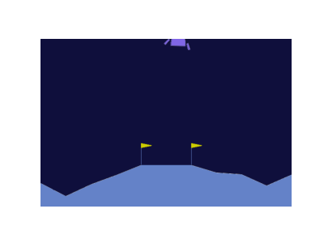

# 🚀 LunarLander_RL: PPO vs. DQN in Dynamic Environments

[](https://www.python.org/)
[](https://gymnasium.farama.org/)
[](https://stable-baselines3.readthedocs.io/)
[]()

## 🎯 Project Overview
This project evaluates the robustness of Reinforcement Learning algorithms by extending the classic **LunarLander-v3** environment. I developed a custom physics wrapper that introduces **stochastic environmental factors**—variable gravity, wind turbulence, and finite fuel constraints—to simulate realistic "Deep Space" deployment.

The goal was to benchmark **Proximal Policy Optimization (PPO)** against **Deep Q-Networks (DQN)** to determine which architecture better generalizes to unpredictable physical dynamics.

---

## 📈 Executive Performance Summary
The study demonstrated that PPO significantly outperforms DQN in dynamic environments. While DQN struggled to converge under changing transition dynamics, PPO maintained a stable policy, achieving a **60% success rate** in the most volatile conditions.

| Environment | Model | Mean Reward | Success Rate | Status |
| :--- | :--- | :--- | :--- | :--- |
| **Original (Static)** | **PPO** | **281.48** | **98.0%** | **🏆 Solved** |
| Original (Static) | DQN | 49.36 | 6.0% | Unstable |
| **Custom (Dynamic)** | **PPO** | **157.10** | **60.0%** | **⭐ Robust** |
| Custom (Dynamic) | DQN | -143.66 | 1.0% | Failed |

**Key Takeaway:** PPO's on-policy updates proved essential for handling the non-stationary dynamics of wind and variable gravity, whereas DQN's value estimation collapsed due to the high variance in state transitions.

---

## 🔬 Technical Deep Dive

### 1. The "Deep Space" Custom Environment
I implemented a `gym.Wrapper` to transform the deterministic Lander problem into a stochastic control task:

* **Variable Gravity:** Randomized between `-8.0` and `-12.0` per episode.
* **Wind Turbulence:** Applied stochastic wind forces (Power: `5.0` - `20.0`) with turbulence factors (`0.5` - `1.5`).
* **Finite Fuel System:** Added a fuel constraint (1000 units). The observation space was expanded to include `fuel_remaining`.
* **Dynamic Mass:** The lander's density changes in real-time as fuel is consumed, altering inertia.

### 2. Model Configuration
* **PPO (Proximal Policy Optimization):** Configured with `n_steps=2048` and `batch_size=64` to stabilize learning over long trajectories.
* **DQN (Deep Q-Network):** Tested with a large replay buffer (`500,000`) and increased exploration (`0.2`), but struggled to correlate discrete actions with the continuous variations of wind.

---

## 📊 Visual Insights

| Standard Environment | Custom "Deep Space" Environment |
| :---: | :---: |
|  |  |
| *Stable, vertical descent.* | *Fighting lateral wind & gravity shifts.* |

*(Note: In the Custom Environment, the dark blue background signifies the active wind/gravity randomization mod.)*

---

## 🛠️ Installation & Usage

### 1. Setup
```bash
git clone [https://github.com/YourUsername/Robust-Lunar-Lander.git](https://github.com/YourUsername/Robust-Lunar-Lander.git)
cd Robust-Lunar-Lander
pip install -r requirements.txt
